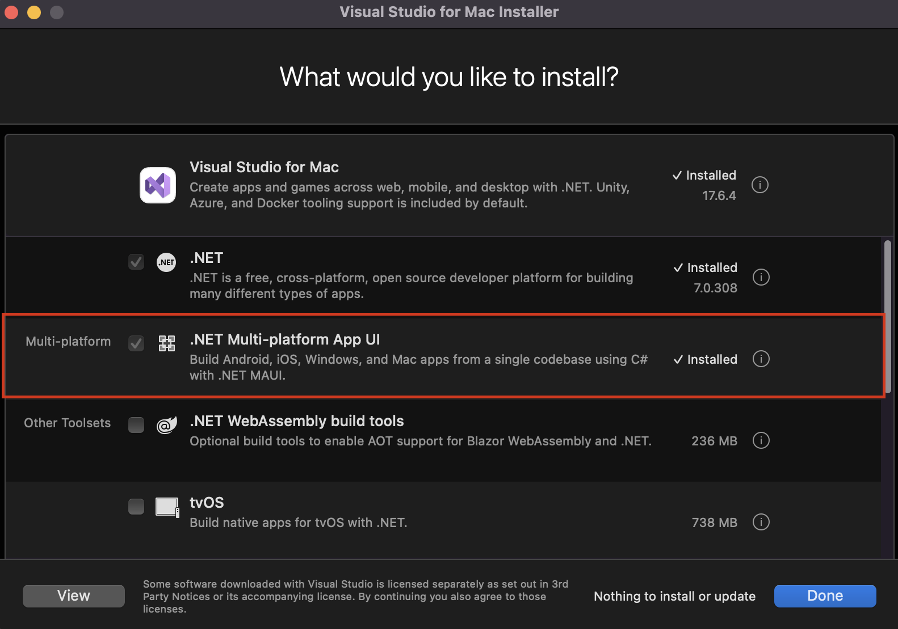
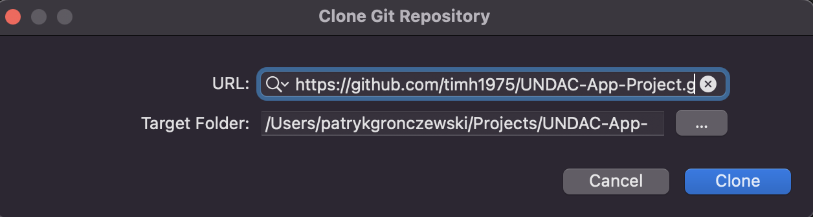
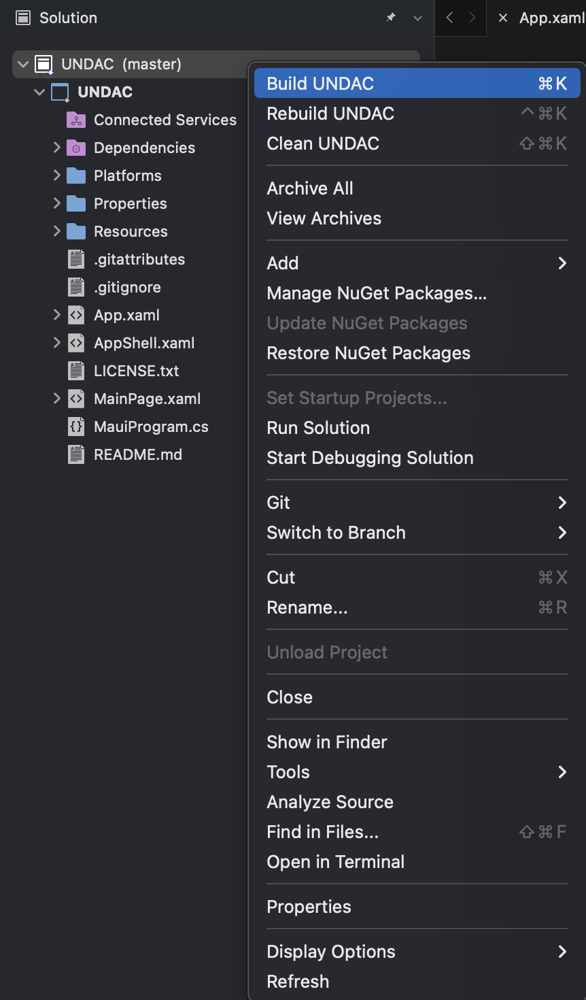
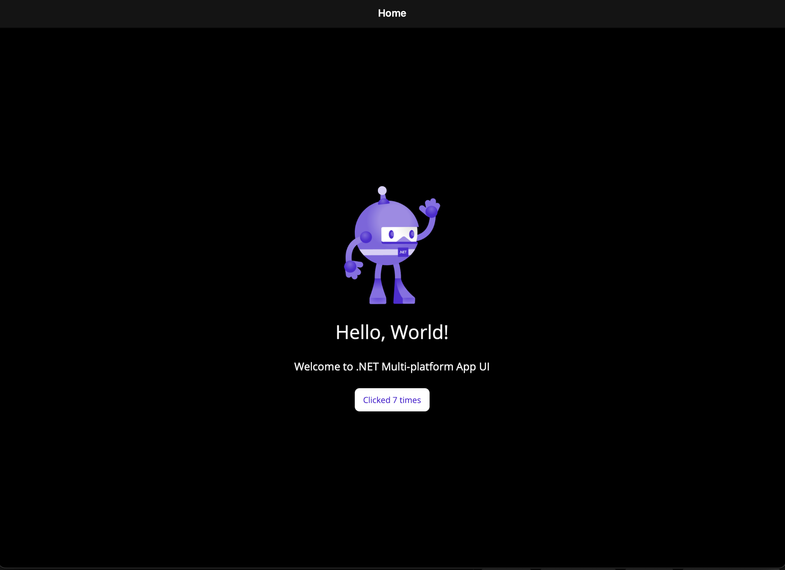

## SETUP

This portfolio entry details the correct set up of my development environment and potential alternative configuration settings 
using C# and Visual Studio (VS) to create a new MAUI app as part of group work.
The configuration began on a macOS system with Visual Studio 2022 and .NET 6 installed.

## Environment configuration
### Visual Studio 

The configuration process begins by updating Visual Studio to the latest version. I used the Visual Studio Update box to check for new updates by navigating to **Visual Studio > Check for Updates...**
<figure>
  
  <figcaption><b>Fig.1 - Visual Studio Update box - Updates to the latest version ready to install</b></figcaption>
</figure>
 
 
Next, I configured the .NET MAUI App template. Before building, signing, and deploying .NET MAUI apps for iOS or macOS, I first needed the latest version of Xcode. Xcode is easily available on the App Store; simply search for "Xcode".

<figure>
  
  <figcaption><b>Fig.2 - App Store - Xcode in App Store</b></figcaption>
</figure>
 
 

Finally, I downloaded and installed .NET MAUI apps using Visual Studio for Mac installer available on the Visual Studio website.
<figure>
  
  <figcaption><b>Fig.3 - Visual Studio for Mac installer - .NET MAUI apps installed</b></figcaption>
</figure>
 
 

 ### Visual Studio and Github
Another step in the configuration was to clone the team's shared repository in Visual Studio and verify that the initial projects and configurations were functioning correctly. I opened Visual Studio, navigated to **File > Clone Repository...**, and entered the URL of the shared repository.
<figure>
  
  <figcaption><b>Fig.4 - Clone Repository - Entering the URL for the team's shared repository</b></figcaption>
</figure>
 
 
After successfully cloning the team's shared repository, I built the project by right-clicking on the solution and selecting 'Build' (Fig. 5). I then ran the project to check if it was working by clicking the play button (Fig. 6).
<figure>
  
  <figcaption><b>Fig.5 - Cloned Repository - Building the project from the cloned repository</b></figcaption>
</figure>
<figure>
  
  <figcaption><b>Fig.6 - Initial Run - Fully configured and working project</b></figcaption>
</figure>

## Reflection

### Limitations and possible improvments 
The configuration is appropriately set up for our project. However, it does have some limitations. Working as a team on a multi-platform app using different machines can introduce inconsistencies. Each team member needs to ensure regular updates and proper management of platform-specific SDKs, such as Xcode for iOS/macOS development. To eliminate the risk of inconsistency, using containers—like Docker, for example could be an effective solution.

### Difficulties and Resolutions
During the configuration, I encountered a difficulty. Since GitHub removed support for using passwords to authenticate Git operations this year, I had to generate a Personal Access Token (PAT) to authenticate when cloning a repository. After generating the token, I removed the website password in the keychain on macOS and replaced it with the generated token.

