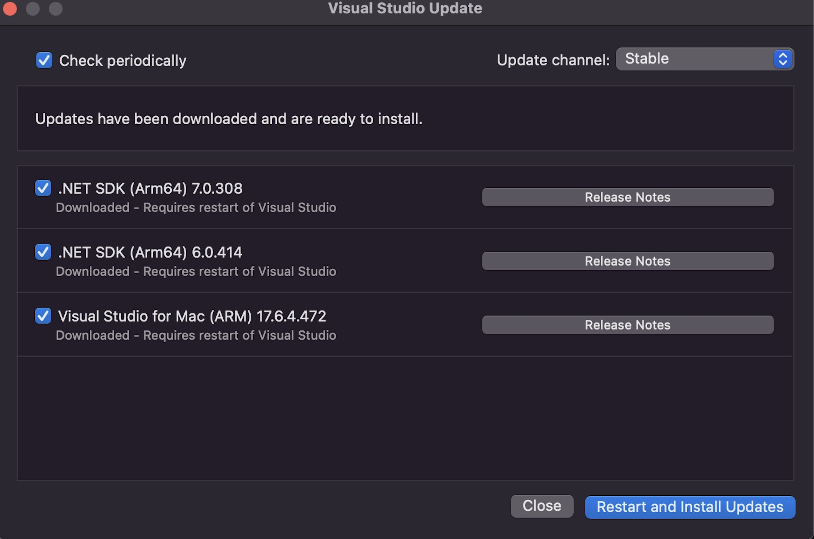
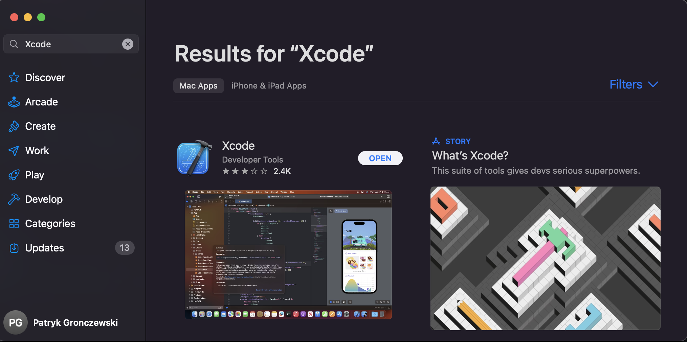

## SETUP

This portfolio entry details the correct set up of my development environment and potential alternative configuration settings 
using C# and Visual Studio (VS) to create a new MAUI app as part of group work.
The configuration began on a macOS system with Visual Studio 2022 and .NET 6 installed.

## Environment configuration
#### Visual Studio 

The configuration process begins by updating Visual Studio to the latest version. I used the Visual Studio Update box to check for new updates by navigating to Visual Studio > Check for Updates....
<figure>
  
  <figcaption><b>Fig.1 - Visual Studio Update box - Updates to the latest version ready to install</b></figcaption>
</figure>
 
 
Next, I configured the .NET MAUI App template. Before building, signing, and deploying .NET MAUI apps for iOS or macOS, I first needed the latest version of Xcode. Xcode is easily available on the App Store; simply search for "Xcode".

<figure>
  
  <figcaption><b>Fig.2 - App Store - Xcode ready for download</b></figcaption>
</figure>
 
 
Finally, I downloaded and installed .NET MAUI apps via Visual Studio for Mac installer from 
[Visual Studio website](https://visualstudio.microsoft.com/vs/mac)

